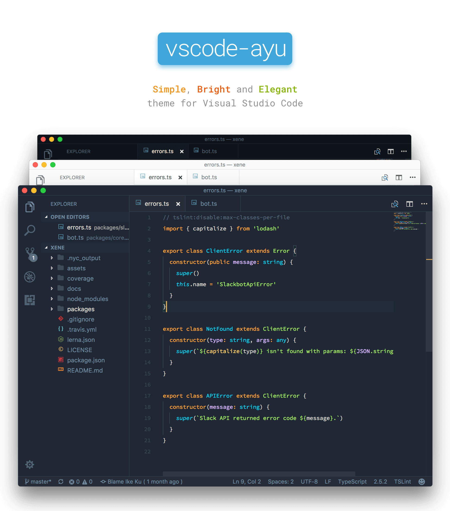

> Source from: https://github.com/dempfi/ayu

A simple theme with bright colors and comes in three versions — *dark*, *light* and *mirage* for all day long comfortable work.

> Note that this isn't a theme maintained by the original [Ayu theme](https://github.com/dempfi/ayu) author so please report issues related to this theme here.

## Install

```shell
ext install ayu
```

Then go to `Preferences > Color Theme > Ayu Light(or Ayu Dark, or Ayu Mirage)`.
If you want to setup File Icon, then go to `Preferences > File Icon Theme > Ayu`.

## Screenshots

#### Light


#### Dark


#### Mirage


## Development

Install dependencies
```shell
npm install
```

Update themes and build VSIX package
```shell
npm run build && npm run package
```
