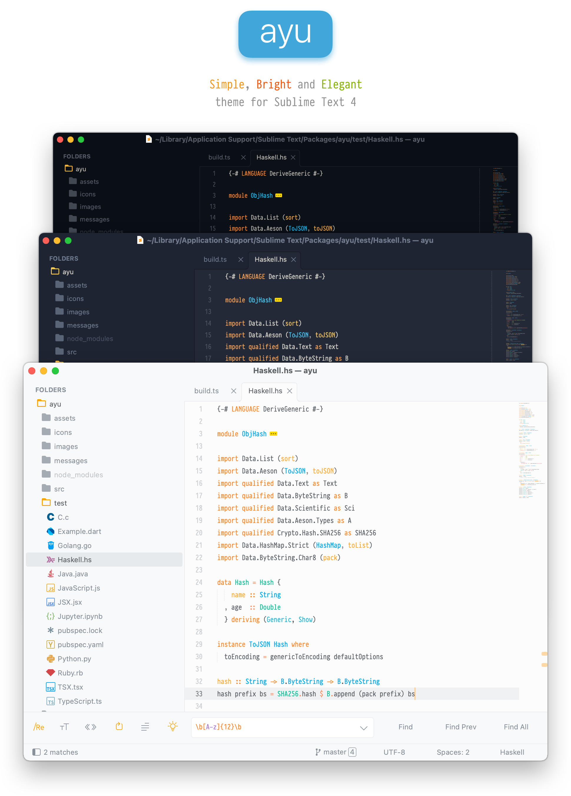
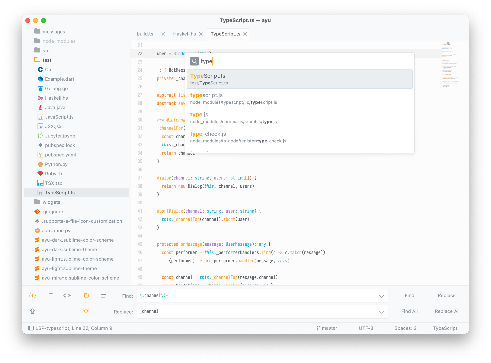
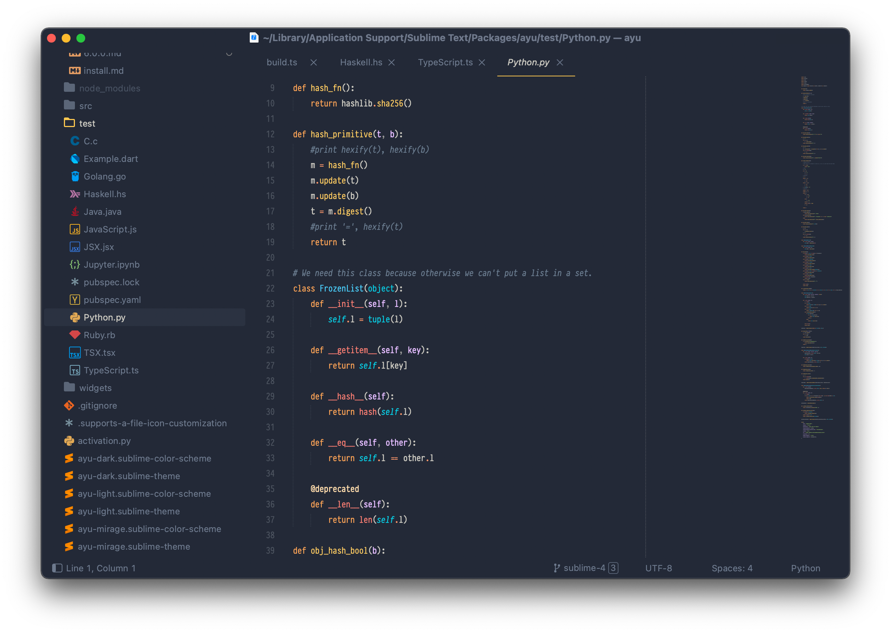
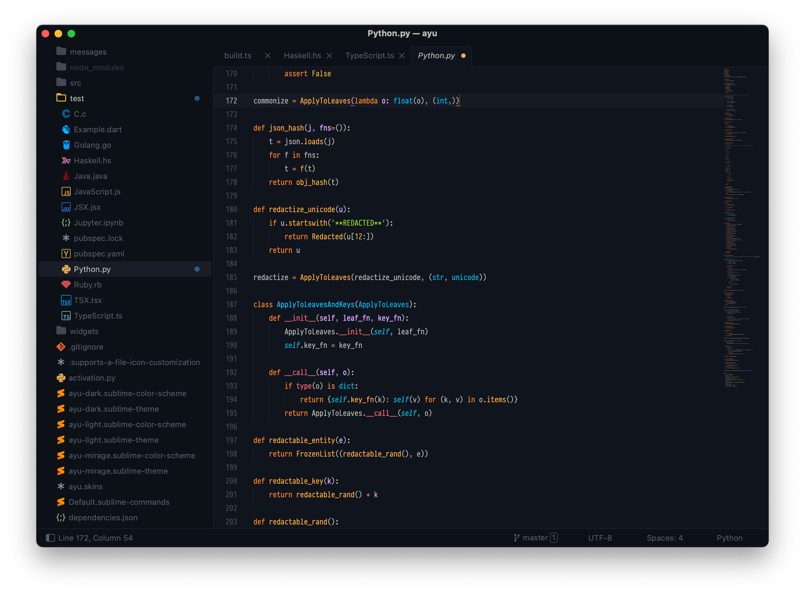

<p align="center">
  
</p>

<p align="center">
  <a href="https://ayutheme.com">Website</a> •
  <a href="#install">Install</a> •
  <a href="#screenshots">Screenshots</a> •
  <a href="#ports">Ports</a>
</p>

---

**ayu** is a bright color theme and comes in three versions — _dark_, _mirage_, and _light_ — for all-day comfortable work. Handcrafted for Sublime Text.

## Install

### Recommended

Install via [Package Control](https://packagecontrol.io/):

1. Press <kbd>cmd/ctrl</kbd> + <kbd>shift</kbd> + <kbd>p</kbd> to open the command palette
2. Type `install package` and press enter
3. Search for `ayu` and install

### Manual

1. Download the [latest release](https://github.com/ayu-theme/ayu/releases/latest)
2. Extract and rename the directory to `ayu`
3. Move it to your Sublime `/Packages` directory *(Preferences > Browse packages...)*

## Activation

Open command palette via <kbd>cmd/ctrl</kbd> + <kbd>shift</kbd> + <kbd>p</kbd> and type `ayu: Activate theme`.

Or add to your user settings *(Preferences > Settings)*:

```json
// Light
"theme": "ayu-light.sublime-theme",
"color_scheme": "Packages/ayu/ayu-light.sublime-color-scheme",

// Mirage
"theme": "ayu-mirage.sublime-theme",
"color_scheme": "Packages/ayu/ayu-mirage.sublime-color-scheme",

// Dark
"theme": "ayu-dark.sublime-theme",
"color_scheme": "Packages/ayu/ayu-dark.sublime-color-scheme",
```

## Screenshots

<h6 align="center">Light with <code>ui_separator</code> option</h6>



---

<h6 align="center">Mirage</h6>



---

<h6 align="center">Dark with <code>ui_separator</code> option</h6>



## Customization

### Settings

```json
"ui_native_titlebar": true,   // native titlebar on macOS
"ui_separator": false,        // hide separators between panels (shown by default)
"ui_wide_scrollbars": true    // wider scrollbars
```

### File Icons

ayu ships its own file icons, the same set as ayu for VS Code. Sublime Text needs the [A File Icon](https://github.com/SublimeText/AFileIcon) package to show them: it decides which icon each file gets, and ayu supplies the artwork. File types without an ayu icon keep A File Icon's own.

### Custom UI Fonts

1. Open command palette and type `Browse packages`
2. Navigate to `/User`
3. Create `ayu-mirage.sublime-theme` (or `ayu-light`/`ayu-dark`)
4. Add:

```json
[
  { "class": "sidebar_label", "font.face": "Your Font" },
  { "class": "sidebar_heading", "font.face": "Your Font" },
  { "class": "tab_label", "font.face": "Your Font" },
  { "class": "label_control", "font.face": "Your Font" },
  { "class": "quick_panel_label", "font.face": "Your Font" },
  { "class": "quick_panel_path_label", "font.face": "Your Font" }
]
```

## Legacy Versions

- **Sublime Text 3**: [v5.1.0](https://github.com/ayu-theme/ayu/releases/tag/v5.1.0)
- **Sublime Text 2**: [v3.2.2](https://github.com/ayu-theme/ayu/releases/tag/3.2.2)

## Ports

ayu is available for:

- [VS Code](https://github.com/ayu-theme/vscode-ayu)
- [and more...](https://ayutheme.com)

---

<p align="center">
  <a href="https://ayutheme.com">ayutheme.com</a> •
  <a href="https://ko-fi.com/dempfi">Buy me a coffee</a>
</p>
