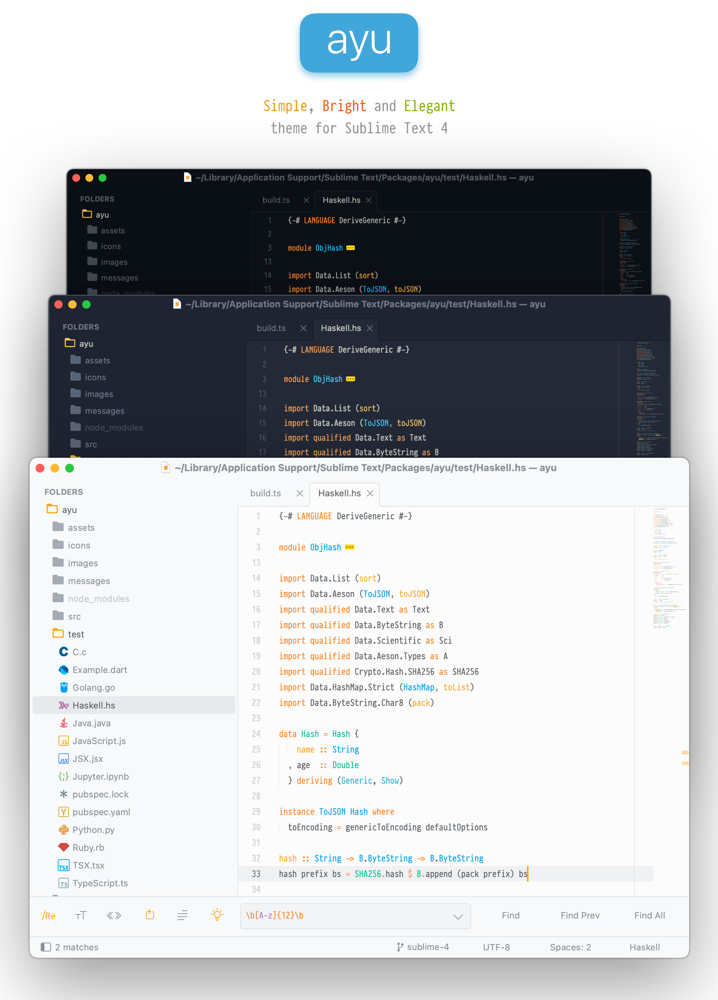

`ayu` is a simple theme with bright colors and comes in three versions — *dark*, *mirage* and *light* for all day long comfortable work.

### File Icons

`ayu` from version `3.0.0` supports customization via [A File Icon](https://github.com/ihodev/a-file-icon) package. Please install it and restart Sublime for better experience.

### Custom UI fonts

Since verion `5.0.0` monospaced fonts options were removered. But it's still possible to use your favourite font in the
user interface of the theme, just follow through these simple steps:


1. Pull up command pallete via <kbd>cmd/ctrl</kbd> + <kbd>shift</kbd> + <kbd>p</kbd>
2. Type in `Browse packages`
3. Navigate to the `/User` folder
4. Create a file named `ayu-mirage.sublime-theme` to modify mirage or `ayu-light.sublime-theme` and `ayu-dark.sublime-theme`
5. Open that file in Sublime
6. Copy and paste following content:
   ```json
   [
     {
       "class": "sidebar_label",
       "font.face": "PragmataPro Mono Liga"
     },
     {
       "class": "sidebar_heading",
       "font.face": "PragmataPro Mono Liga"
     },
     {
       "class": "tab_label",
       "font.face": "PragmataPro Mono Liga"
     },
     {
       "class": "label_control",
       "font.face": "PragmataPro Mono Liga"
     },
     {
       "class": "quick_panel_label",
       "font.face": "PragmataPro Mono Liga"
     },
     {
       "class": "quick_panel_path_label",
       "font.face": "PragmataPro Mono Liga"
     }
   ]
   ```
7. Replace `PragmataPro Mono Liga` with the font of your choice
8. Save and enjoy :)

### Screenshots

<h6 align='center'>Light with <code>ui_separator</code> option on</h6>


---


<h6 align='center'>Mirage with <code>ui_separator</code> option off</h6>


---

<h6 align='center'>Dark with <code>ui_separator</code> option on</h6>


### Settings

```js
"ui_native_titlebar":       true, // use native titlebars on macOs
"ui_separator":             true, // separators between panels
"ui_wide_scrollbars":       true, // wider scrollbars
```

---

### Installation

###### Recommended

You can install `ayu` via [Package Control](https://packagecontrol.io/).

1. Press <kbd>cmd/ctrl</kbd> + <kbd>shift</kbd> + <kbd>p</kbd> to open the command palette.
2. Type `install package` and press enter. Then search for `ayu`

###### Manual

1. Download the [latest release](https://github.com/dempfi/ayu/releases/latest), extract and rename the directory to `ayu`.
2. Move the directory inside your sublime `/Packages` directory. *(Preferences > Browse packages...)*

---

### Activation

###### Recommended

Open command palette via `Tools > Command Palette` (or <kbd>cmd/ctrl</kbd> + <kbd>shift</kbd> + <kbd>p</kbd>) and type `ayu: Activate theme`.


###### With Skins package

[Skins](https://packagecontrol.io/packages/Skins) provides a simple and efficient way to change themes, save your own presets and quickly try out new looks. Activation is as simple as opening up the command palette, running `Select Skin` and choosing `Ayu - Dark` or `Ayu - Light` from the list.


###### Via Preferences

Add these lines to your user settings *Preferences > Setting - User*:

For light theme:

```js
"theme": "ayu-light.sublime-theme",
"color_scheme": "Packages/ayu/ayu-light.sublime-color-scheme",
```

For mirage theme:

```js
"theme": "ayu-mirage.sublime-theme",
"color_scheme": "Packages/ayu/ayu-mirage.sublime-color-scheme",
```

For dark theme:

```js
"theme": "ayu-dark.sublime-theme",
"color_scheme": "Packages/ayu/ayu-dark.sublime-color-scheme",
```

### Sublime Text 2

ayu no longer supports Sublime Text 2. But you still can download
and install manually [previous version](https://github.com/dempfi/ayu/releases/tag/3.2.2).

### Related projects and ports

- `ayu` for Ace: https://github.com/ayu-theme/ayu-ace
- `ayu` colors as NPM package: https://github.com/ayu-theme/ayu-colors
- `ayu` for VSCode: https://github.com/teabyii/vscode-ayu

<div align="right"><sup>
  made with ❤️ by <a href="https://github.com/dempfi">@dempfi</a>
</sup></div>
